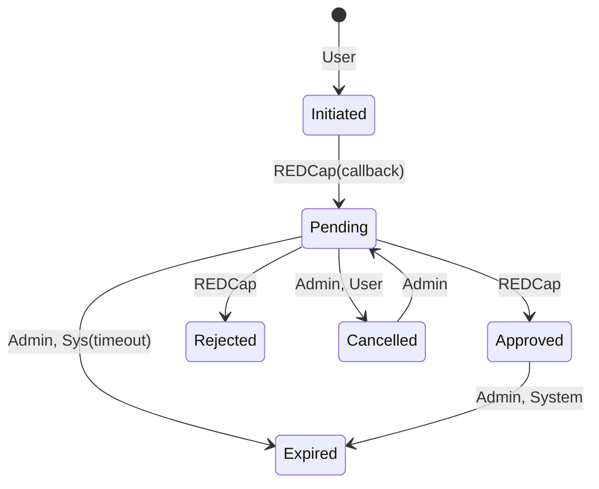

# **Request Workflow Sync Between Web App and REDCap**

## 1. **Overview**

This document describes the architecture and logic for synchronizing access request status between our web application and REDCap, which serves as the workflow engine.

The system enables users to initiate cohort access requests via our app, redirects them to a REDCap form, and periodically synchronizes request status decisions back into our system via polling.


## 2. **Functional Requirements**

### 2.1 User Stories

#### As a User:
- I should be able to initiate a request for access to a cohort.
- I should be redirected to REDCap to complete necessary forms.
- I should see the status of my requests in the UI.
- I should be able to cancel my request before it is approved or rejected.
- I should be able to create a new request if the previous one is cancelled, rejected, or expired.

#### As an Admin:
- I should be able to view all user requests.
- I should be able to update the status of any request (e.g., cancel, expire).
- I should not be able to delete requests.
- I should be able to track who made status changes and when.
- I should not be able to override REDCap decisions once finalized.


## 3. **Technical Requirements**

- Status synchronization must be fault-tolerant and idempotent.
- Only requests originating from the app are considered for sync.
- Requests must be uniquely identified independent of `user_id + cohort_id`.
- Decisions made in REDCap are final; they cannot be updated or reversed.
- Cancellation by the app must prevent further REDCap decisions from affecting request state.
- All status transitions must be logged with actor, timestamp, and change reason.
- Approved requests can expire after a configurable time period.
- All historical data (including audit logs) must be retained indefinitely.


## 4. **System State Model**



### Rationale for Preventing Admin → `APPROVED` / `REJECTED`

#### 1. **REDCap is the sole decision authority**

Your system design explicitly treats REDCap as the source of truth for approvals and rejections. Letting admins override that creates:

- **Ambiguity**: Which decision is authoritative?
- **Race conditions**: REDCap could return a conflicting decision later.

> **Principle**: Maintain a single source of truth for each field — here, REDCap for decision status.

**Confidence**: 10/10 — very high risk of inconsistency if not enforced.

---

#### 2. **Audit and Compliance**

If approval/rejection impacts access to sensitive cohorts, audit trails must clearly show:

- Who approved
- Based on what information
- At what time

Allowing manual override weakens compliance and accountability. Admins might shortcut or “fix” data without REDCap workflow, violating process integrity.

---

#### 3. **Future Extensibility**

If you later integrate automated rule-based approval or federated systems, manual overrides will become technical debt.

Preventing them now ensures a clear boundary for future logic.

---

### What Admins **Should** Be Allowed To Do

- **Cancel** a pending request
- **Expire** an approved request (or trigger expiry early)
- **Delete** malformed requests (if needed and audit-logged)
- **Re-initiate** workflows by creating new requests


## 5. **Data Model**

### `requests` table
| Field              | Type            | Notes |
|-------------------|------------------|-------|
| `id`              | INT (PK)           | Generated at creation |
| `request_id`      | UUID               | Generated at creation and unique |
| `user_id`         | INT                | FK to users table |
| `cohort_id`       | UUID               | FK to cohort table |
| `status`          | ENUM               | `initiated`, `pending`, `approved`, `rejected`, `cancelled`, `expired` |
| `decision_date`   | TIMESTAMP          | When status changed to APPROVED / REJECTED |
| `requester_id`    | UUID               | User or Admin who created it |
| `created_at`      | TIMESTAMP          | Request creation time |
| `expires_at`      | TIMESTAMP (nullable) | Set when expired |
| `upstream_record_id`| TEXT (nullable)  | REDCap's internal ID |
| `version`         | INT                | Version to implement optimistic locking |
| `last_synced_at`  | TIMESTAMP          | For tracking last REDCap sync |

**Unique Index:** `(user_id, cohort_id, status != 'cancelled' AND status != 'expired' AND status != 'rejected')`  
*Note:* To allow multiple requests over time while avoiding simultaneous duplicates.


### `request_audit_log` table
| Field                | Type             | Notes |
|----------------------|------------------|-------|
| `audit_id`           | SERIAL (PK)      |  |
| `request_id`         | UUID             | FK to requests |
| `changed_by_id`      | INT              | FK to users |
| `source`             | ENUM             | `admin`, `user`, `polling`, `system` |
| `old_data`           | ENUM             |  |
| `new_data`           | ENUM             |  |
| `timestamp`          | TIMESTAMP        |  |
| `reason`             | TEXT (nullable)  | Optional notes |


## 6. **System Workflow**

### 6.1 Request Creation

- User initiates a request → `request_id` is generated.
- App creates DB record with `status = 'initiated'`.
- User is redirected to REDCap with query parameters:
  ```
  ?cohort_id=<rid>&request_id=<uuid>&email=<email>&first_name=<first_name>&last_name=<last_name>&institution=<institution>&institution_type=<institution_type>&cohort_details=<cohort_details>
  ```
- REDCap form is configured to capture these values. request_id in hidden field.

### 6.2 Callback from REDCap
- When user fills out the REDCap form and submits, it triggers a redirect to our web app with the following parameters:
  ```
  ?request_id=<uuid>
  ```
- If the user is not logged in, they are redirected to the login page. After logging in, they are redirected to the original URL with the `request_id` parameter.
- The app looks up the `request_id` in the DB and starts sync process based on `request_id`.
  - API call to REDCap to get records with `request_id` and perform update step as in polling.
- If the request is not found in the DB, it is ignored.
- If the request is found, the app updates the status to `pending` and sets `last_synced_at` to current time.

### 6.3 Status Sync (Polling)

- Runs every 30 minutes.
- Filters REDCap data to records modified since `min(created_at)` of all pending requests.
- For each record:
  - Extract `request_id`, `user_id`, `cohort_id`, `decision`, `decision_date`.
    - use `email` to find `user_id` in DB. Ignore record if failed.
    - validate `cohort_id` is in DB. Ignore record if failed.
    - validate `request_id` is in DB. Ignore record if failed.
    - parse date fields from string and convert to UTC.
    - parse status fields from string and convert to ENUM.
    - compute a `last_modified` timestamp from `*_timestamp` fields. Parse and find the most recent.
  - If there are multiple records for the same `request_id`, use the most recent one (`last_modified`).
    - If all of the records have null `last_modified`, ignore all of them.
  - If request in DB is not in `initiated`or `pending` → ignore.
  - If REDCap decision or one of the stages decision has changed:
    - Update statuses and decision dates.
    - If the new status is `approved` set `expires_at` from config.
    - Set `last_synced_at` to current time.
    - Write to audit log.

## 7. **Actions**
### 7.1 Admin Actions

- **Cancel Request**:  
  - Valid only if `status = pending`.  
  - Set `decision_date`, update status to `cancelled`, log change.
- **Expire Request**:
  - Valid only if `status = approved`.
  - Set `expires_at`, `decision_date` to current time, update status to `expired`, log change.
- **Restart Request**:
  - Valid only if `status = cancelled` or `status = expired`.
  - Set status to `pending`, clear `decision_date`, and log the change.
- **Set Expiry Date**:
  - Valid only if `status = approved`.
  - Set `expires_at` to new date, log change.
- **Delete Request**:
  - ??
- **Add notes**:
  - Valid only if `status = cancelled`.
  - Add notes to audit log, no other changes.

### 7.2 User Actions

- **Cancel Request**:  
  - Valid only if `status = pending`.  
  - Set `decision_date`, update status to `cancelled`, log change.

### 7.3 System Actions

- **Expire Approved Request**:
  - Background job checks for `approved` requests and `expires_at` less than current time.
  - Set `decision_date` to current time, update status to `expired`, log change.

- **Expire Pending Request**:
  - Background job checks for `pending` requests older than x days.
  - Set `decision_date` to current time, update status to `expired`, log change.

## 8. **Edge Case Handling**

| Scenario | Handling |
|----------|----------|
| REDCap finalizes a request after it was cancelled | Ignore, skip in polling if `cancelled_at` is set |
| REDCap returns null `decision_date` | Treat as not finalized |
| Admin creates request for user | Same workflow, `created_by` is admin |
| REDCap doesn’t include `request_id` | Fallback to `user_id + cohort_id`, but only for compatibility; eventually deprecate |

Re-requests:
- **User starts a request**, but **abandons** it before submitting the REDCap form.
- Because REDCap has no record yet, the DB has a pending request with no `redcap_record_id`.
- Until REDCap submits and we poll to sync, we can’t know if it was completed.
- If user revisits the page before sync, we let them re-initiate — this leads to **duplicate REDCap submissions**.

## 9. **Extensibility Considerations**

- **Historical Insight**: audit log allows full timeline reconstruction.
- **Optional Enhancements**:
  - Notification system when status changes.
  - Admin notes field for cancellations.
  - Filtering requests in UI by status/date/user.


## 10. **Open Questions**

1. Should we show REDCap decision timestamps in the UI?
2. Do we want to enforce a cool down period before retrying a rejected request?
3. Should user cancellation require confirmation or justification?


## 11. Status Sync (Polling)

### Overview

The **Status Sync (Polling)** script is responsible for synchronizing REDCap records with the database. It runs periodically (every 30 minutes) to fetch and process records from REDCap, ensuring that the database reflects the latest decisions and statuses. This script uses a backoff mechanism to handle errors gracefully and retries with increasing intervals.

### Key Features

1. **Polling Interval**: Runs every 30 minutes (configurable via `redcap.polling.interval_seconds`).
2. **Data Fetching**:
   - Uses the `getRecords` function from the redcap.js service to fetch records from REDCap.
   - Filters records based on the `created_at` timestamp of pending requests in the database.
   - Converts date fields from REDCap's timezone to UTC for consistency.
3. **Logging**:
   - Logs all errors, skipped records, and changes to requests using the `logger` module.
   - Maintains a daily rotating log file (`redcap-poll-errors-%DATE%.log`) for error tracking.
4. **Record Validation**:
   - Ensures `request_id`, `user_id`, and `cohort_id` exist in the database.
   - Parses and validates date fields, converting them to UTC.
   - Converts status fields to ENUM values.
5. **Record Deduplication**:
   - For multiple records with the same `request_id`, only the most recent (`last_modified`) is processed.
   - If all records for a `request_id` have `null` `last_modified`, they are ignored.
6. **Database Updates**:
   - Updates requests in `initiated` or `pending` status only.
   - Synchronizes REDCap decisions and stages with the database.
   - Sets `expires_at` for approved requests based on configuration.
   - Logs all changes for auditing purposes.

### Configuration

The script relies on the following configuration values:

- **Polling Interval**: `redcap.polling.interval_seconds` (default: 1800 seconds).
- **Maximum Backoff**: `redcap.polling.max_backoff_seconds` (default: 3600 seconds).
- **Batch Size**: `redcap.polling.update_batch_size` (default: 100 records per batch).
- **Expiration Settings**:
  - `access_requests.expiration.enabled`: Enables expiration date setting for approved requests.
  - `access_requests.expiration.days`: Number of days until expiration.

### Workflow

#### 1. Polling Logic

The script starts by invoking the `poll` function, which:
- Fetches records from REDCap using the `performSyncWork` function.
- Implements an exponential backoff mechanism for error handling:
  - On success, the polling interval resets to the default.
  - On failure, the interval doubles up to the maximum backoff limit.

#### 2. Record Processing

The `performSyncWork` function:
1. **Fetches Records**:
   - Retrieves the `created_at` of the oldest pending request from the database.
   - Fetches REDCap records modified after `min(created_at) - 2 * polling_interval` using the `getRecords` function.
   - Logs the number of records fetched and any errors encountered during the fetch.
2. **Processes Records in Batches**:
   - Splits records into batches of size `redcap.polling.update_batch_size`.
   - For each batch, calls `processRecords`.

#### 3. Record Validation and Transformation

The `processRecords` function:
- **Transforms Records**:
  - Extracts and validates `request_id`, `user_id`, `cohort_id`, and other fields.
  - Parses date fields and converts them to UTC.
  - Computes the `last_modified` timestamp from `*_timestamp` fields.
- **Deduplicates Records**:
  - Groups records by `request_id` and keeps the most recent (`last_modified`).
  - Ignores groups where all records have `null` `last_modified`.
- **Filters Records**:
  - Ignores requests not in `initiated` or `pending` status.
- Logs validation errors and skipped records for debugging.

#### 4. Database Updates

For valid records:
- Updates the request's status, decision dates, and stages.
- Sets `expires_at` for approved requests if expiration is enabled.
- Updates `last_synced_at` to the current time.
- Logs changes to the audit log using the `logger` module.

### Error Handling

- **Polling Errors**: Uses exponential backoff to retry polling on failure.
- **Record Errors**: Logs errors for invalid records (e.g., missing `request_id`, invalid `cohort_id`) to the rotating log file.
- **Database Errors**: Logs errors encountered during updates.

### Logging and Auditing

- The `logger` module is used for all logging purposes:
  - Errors are logged to a daily rotating log file (`redcap-poll-errors-%DATE%.log`).
  - Changes to requests are logged for auditing purposes.
- Logs include timestamps, log levels, and structured messages for easy debugging and monitoring.

### Running the Script

To run the polling script:

```bash
cd api/
node src/scripts/poll_redcap.js
```

Ensure the following prerequisites are met:
- Environment variables are configured using `dotenv-safe`.
- Required configurations are set in the `config` module.

