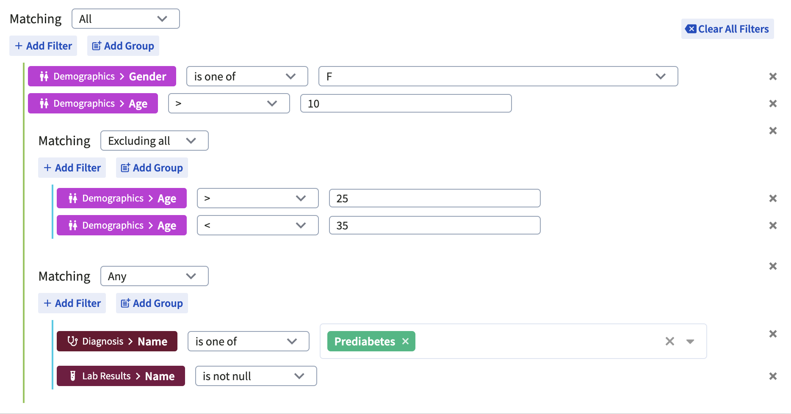
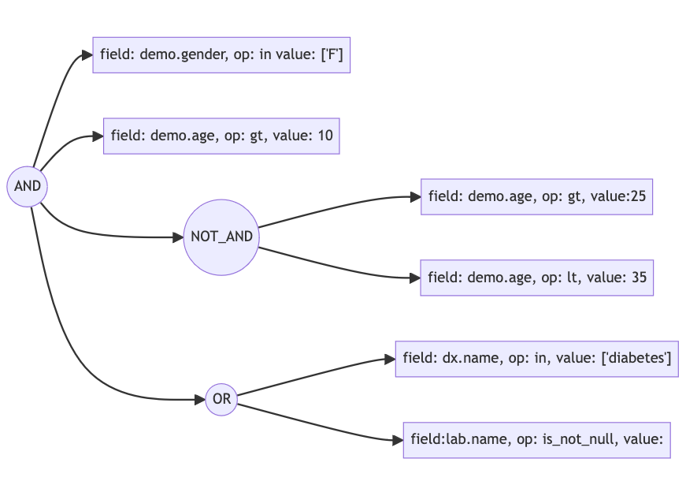
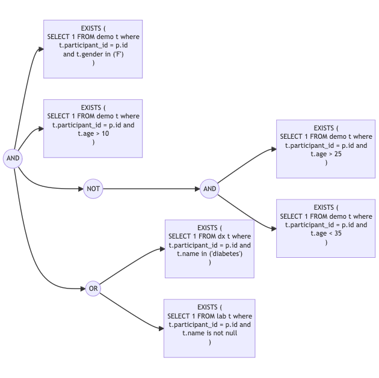

## API

### Cohort APIs

Search Participants
- finds participants given a query
- can save these participants to a temporary cohort and return the id and count
- scheduled job to remove temp cohorts

Create a cohort
- input: query, name, description, is_protected, is_published, is_locked
- executes query and saves participants to a cohort
- returns cohort object with size but not the participant list

Update a cohort by id
- input: id, name, description, is_protected, is_published, is_locked, query
- updates cohort with metadata and if query is provided, re-executes the query and updates the participants
- returns cohort object with size but not the participant list

Get One
- a single cohort by id

Get Many
- multiple cohorts by filters
  - author
  - name or description contains search term
  - is_published
- supports pagination, sort by name, created_at, updated_at, size


### Phenotype data APIs:

Get total participant count

Get unique values of fields with low cardinality

Typo safe autocomplete for fields with high cardinality

Values that starts with search term for fields with high cardinality but have structured data like ICD codes

## Query Schema

A cohort's query is polymorphic, each type capable of different filtering operations. These queries can be categorized into three main types:
- Phenotype: filters based on phenotype data
- Genotype: filters based on genotype data
- Combination: combines multiple cohorts using set operations like union, intersection, difference, and symmetric difference

The combination operation on cohorts is endomorphic (self-map) that means that the result of the combining cohorts is also a cohort. The combined cohort can be seen as resulting from a query that contains the ids of the cohorts to combine and the set operation to apply. Consequently, the result is also a cohort and can be used in further combination operations. This allows the portal operators / researchers to build and publish base cohorts that can be used by other users to build more complex cohorts.

Query's schema is uniquely identified by namespace + name + version. The set of rules that define a cohort is called "criteria" in the query.

```json
{
  "name": "",
  "namespace": "",
  "version": "",
  "criteria": {}
}
```

### Versioning

Each schema is named and versioned. This allows for backward compatibility and easy migration. Each schema type is associated with a SQL generation function. Changes in data model are handled by introducing a new version of the schema.
When a new version of the schema is introduced, the SQL generation function is updated to handle the new schema while the old SQL generation function is kept for backward compatibility. The alternative could be to find all older queries stored in the database and update them to the new schema. This is may be a better approach if the number of queries is small and the schema changes are not frequent. However, if a cohort is published, it is better to keep the query as is and introduce a new version of the schema and SQL generation function.

### Validation

AJV is used to validate the query schema. Validating the query schema ensures that the query is well-formed and the fields are valid. The middleware the processes the query will be free from conditional checks and can focus on executing the query. As a result, the middleware is easier to maintain and the code is more readable.

### Phenotype Query
Phenotype query is validated against the schema of the dataset to ensure that the fields are valid and the operators are supported. Phenotype query has a recursive tree structure, where the non-leaf nodes are the logical operators (AND, OR, NOT_AND, NOT_OR) and filters are the leaf nodes. The filters are validated against the schema of the database generated by Prisma client. If a field is not found in the schema, the query is rejected. If a field is found but the operator is not supported, the query is rejected. If a field is found and the operator is supported, the query is accepted. The query is then passed to the SQL generation function to generate the SQL query.



```javascript
{
  operator: "AND",
  children: [
    {field: 'demographic.gender', operator: 'in', value: 'F'},
    {field: 'demographic.age', operator: 'gt', value: 10},
    {operator: "OR", children: [
      {field: 'dx.name', operator: 'in', value: 'diabetes'},
      {field: 'lab.name', operator: 'is_not_null', value: null}
    ]},
    {operator: "NOT_AND", children: [
      {field: 'demographic.age', operator: 'gt', value: 25},
      {field: 'demographic.age', operator: 'lt', value: 35}
    ]}
  ]
}
```




### Combination Query
```javascript
{
  cohort_ids: ['c-1', 'c-2', 'c-3'],
  operators: ['UNION', 'INTERSECTION']
}
```
For simplicity, the combination query is a list of cohort ids and a list of operators. The operators are applied to the cohort ids in the order they are provided. The result of the first operator is then combined with the next cohort id using the next operator. This process continues until all the cohort ids are combined. The result is a cohort that contains the participants that satisfy the combination query.

Order of evaluation:
```
(('c-1' UNION 'c-2') INTERSECTION 'c-3')
```

## SQL Generation

### Phenotype Query

The SQL for Phenotype query is generated by traversing the query tree. The leaf SQL prepared statement is generated by the field type and the operator. The field type is used to determine the table and the column. The operator is used to determine the comparison operator. The prepared statement is then combined with the parent node's SQL using the logical operator. This process continues until the root node is reached. The root node's SQL is the final SQL query.



```sql
SELECT COUNT(p.id) as count
  FROM participant p
  WHERE (
  EXISTS (
    SELECT 1
    FROM demographic t
    WHERE
      t.participant_id = p.id
      AND gender IN (?)
  )
  AND
  EXISTS (
    SELECT 1
    FROM demographic t
    WHERE
      t.participant_id = p.id
      AND extract(year from age(dob)) > ?
  ) 
  AND 
  NOT(
    EXISTS (
      SELECT 1
      FROM demographic t
      WHERE
        t.participant_id = p.id
        AND extract(year from age(dob)) > ?
    ) 
    AND
    EXISTS (
      SELECT 1
      FROM demographic t
      WHERE
        t.participant_id = p.id
        AND extract(year from age(dob)) < ?
    )
  ) 
  AND
  (
    EXISTS (
      SELECT 1
      FROM dx t
      WHERE
        t.participant_id = p.id
        AND name IN (?)
    )
    OR
    EXISTS (
      SELECT 1
      FROM lab t
      WHERE
        t.participant_id = p.id
        AND name IS NOT NULL
    )
  )
)
```

```javascript
[ 'F', 10, 25, 35, 'Prediabetes' ] // cSpell: ignore Prediabetes
```

Because of the structure of phenotype data, the SQL query is generated using EXISTS subquery. This is because the phenotype data is normalized and spread among 7 different tables and has exponential many to many relationships. Hence, joins are not used to avoid the cartesian product. Instead, the query is designed as a tree of subqueries. The root query is on the participant table while the leaf subqueries are on the phenotype tables. Each subquery is a EXISTS subquery that checks if the current participant satisfies that particular filter. The subqueries are then combined using logical operators. The final SQL query is then executed to get the count of participants that satisfy the query.

This approach is efficient because the EXISTS subquery stops as soon as it finds a match. This is because the EXISTS subquery is a semi-join and the database engine stops as soon as it finds a match. This is different from the JOIN where the database engine has to find all the matches. The EXISTS subquery is also efficient because the phenotype tables are indexed on the participant_id. This means that the database engine can quickly find the matches using the index.

All but the dx (diagnosis) table are indexed on the participant_id. dx table is huge with 15 million rows and the index size on participant_id would be 151 MB. Adding an index slows down the queries on dx table. Sequence scans are faster than index scans here. If an index is present the query planner is preferring to using the index and the query is slower. The query planner runs other filters to find a subset of participants and then checks the dx filter on each participant in a loop using the index. This is slower than running the dx filter on all participants in a sequence scan. Without the index, the query planner runs the dx filter on all participants in a sequence scan and then runs other filters on the subset of participants. This approach is faster because the dx table is huge and other tables are not huge or have many rows for a participant. 

### Combination Query

Postgres provides UNION, INTERSECT, EXCEPT operators that align with UNION, INTERSECTION, DIFFERENCE set operations in the combination query. The SQL for combination query is generated by combining the SQL for retrieving the participant ids given cohort id using the set operation.

The sql for extracting participant ids from a cohort is generated by unnesting the participants array column and then using the unnested participant ids in a subquery. The subquery is then combined using the set operation. The result is then used to get the count of participants.

```sql
SELECT COUNT(*) as count FROM (
  (select unnest(participants) as participant_id from cohort c where c.id=CAST(? AS UUID))
  UNION
  (select unnest(participants) as participant_id from cohort c where c.id=CAST(? AS UUID))
) as t
```

Symmetric difference is not supported by Postgres. To support symmetric difference, the SQL for difference is generated and then the SQL for union is generated. The SQL for symmetric difference is then generated by combining the SQL for difference and union.

```sql
SELECT COUNT(*) as count FROM (
  (
    (select unnest(participants) as participant_id from cohort c where c.id=CAST(? AS UUID))
    EXCEPT
    (select unnest(participants) as participant_id from cohort c where c.id=CAST(? AS UUID))
  )
    UNION
  (
    (select unnest(participants) as participant_id from cohort c where c.id=CAST(? AS UUID))
    EXCEPT
    (select unnest(participants) as participant_id from cohort c where c.id=CAST(? AS UUID))
  )
) as t
```


## Cohort Database Schema

A cohort is a collection of participants determined by a query. Both the query in its JSON form as well as the participant_ids resulted from the query are stored in a single row in the cohort table. 

Storing the query allows
- users to load and edit their cohorts
- users to share the blueprint of the cohort with other users
- operators to review cohorts created by users

Storing the participant_ids allows for 
- quick retrieval of the participants in the cohort for export or visualization
- freezing the result of execution of the query on the data that was available at the time of execution. This is important because new data is periodically added to the database and the query result can change over time.
- combination of different types of cohorts without re-executing the queries. This approach reduces the load on the system because the execution of a query can be expensive and time consuming. While combining cohorts, without the participant_ids, the system would have to re-execute all the queries to get the participants to combine them.

It is important to store both the query and the participant_ids to support all the use cases of the cohort builder. One alone is not sufficient to support all the use cases.


### Participant IDs as Array Column
In the Cohort Builder component, participant IDs are stored directly within the cohort's row as an integer array column. This decision was made to optimize performance, especially considering potential large cohorts containing tens of thousands of participants.

Rationale:

- Efficiency Concerns: Storing participant IDs in a separate table would lead to inefficiencies due to the creation of numerous rows for each cohort. This approach burdens the database with managing extensive rows and indexes, especially during search operations where temporary cohorts are created or updated.

- Performance Benefits: By storing participant IDs within the cohort's row as an integer array column, the database only needs to handle a single row per cohort. This significantly enhances performance as reading and rewriting the participant array is much faster compared to managing individual rows.

Trade-off:

- Relational Joins Compromise: Storing participant IDs in an array column sacrifices the ability to easily perform two-way relational joins. Specifically, finding all cohorts associated with a particular participant becomes more challenging.

- Common Use Cases: The decision to store participant IDs in array columns prioritizes the common use case of finding all participants within a given cohort, which is optimized by this approach.

- Less Common Use Case: While finding all cohorts of a specific participant becomes less straightforward due to the absence of two-way relational joins, this use case is deemed less common in comparison.

The chosen approach of storing participant IDs directly within cohort rows as an integer array column balances the trade-off between performance optimization and relational query complexity, catering primarily to the more frequent and critical use cases within the Cohort Builder component.


### Boolean flags and permissions
The Cohort schema includes several boolean flags that control the state and permissions of a cohort. These flags are:

- `is_locked`
- `is_published`
- `is_protected`
- `is_temp`

#### is_locked

When a cohort is locked (`is_locked = true`), it cannot be changed. This is similar to the 'read-only' attribute in file systems. If a cohort depends on other cohorts, it can only be locked if its dependent cohorts are also locked.

#### is_published

When a cohort is published (`is_published = true`), it becomes searchable and usable by others. Users need approval to publish a cohort. Once a cohort is published, it cannot be unpublished. Also, publishing a cohort locks it, preventing further changes. If a cohort depends on other cohorts, it can only be published if its dependent cohorts are locked.

#### is_protected

When a cohort is protected (`is_protected = true`), others cannot see the underlying query, but authors can. This means that others cannot copy and edit the cohort's rules. This is similar to the 'execute' permission in file systems, where users can run a program but cannot see or modify its source code. If a cohort is protected, it can be searched, used in a combination query, but its rules cannot be seen or copied by others.

#### is_temp

The `is_temp` flag is used to mark temporary cohorts. Temporary cohorts are created when a user searches for participants and to save the results for further use to prevent re-execution of queries. Temporary cohorts are automatically deleted after a certain period of time. This is to prevent the database from being filled with temporary cohorts that are no longer needed.

### Author

Only the author of a cohort can edit or delete the cohort. However, they cannot edit or delete a published cohort. This is to prevent breaking the published cohorts that others depend on. If a cohort is published, it is locked and cannot be edited or deleted by the author.

#### Cascade Delete

If a cohort is deleted, all cohorts that depend on it are also deleted. This is known as a 'cascade delete'. It ensures that there are no cohorts that depend on a non-existent cohort.

## Query Analytics
When a search is performed, the JSON query, generated SQL, execution time, timestamp, and user id are logged. This is to monitor the performance of the queries and to identify slow queries. The slow queries can then be optimized by adding indexes or changing the query. The query analytics can also be used to identify the most frequently used queries and to optimize them. 

## UI

Components
- query builder
- field selection
- actions
- combination

Store

Services

Models
- polymorphism