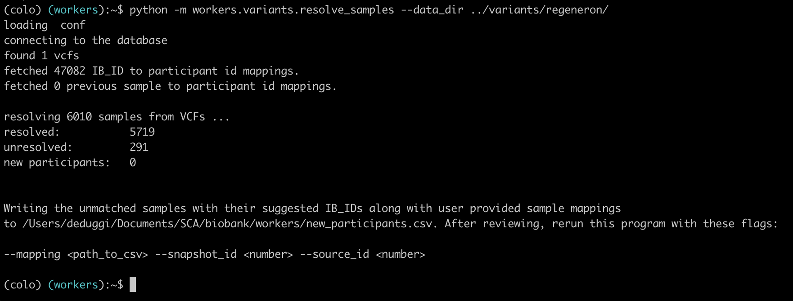
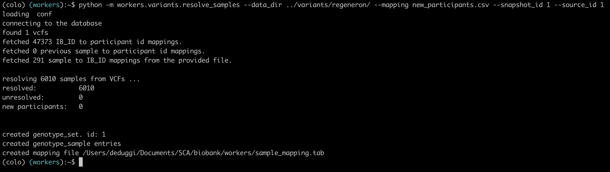

## Introduction

## Phenotype Data Ingestion

```bash
cd /opt/sca/biobank/workers
poetry shell
python -m workers.phenotype.load_data /N/project/biobank/phenotype 1
```

## Regeneron Data Ingestion

### Mapping samples to paritcipants
Assumption: VCFs for each chromosome in the given directory will have the same sample set (same header)

Make sure that the API is up

Mode-1: Without mapping
In this mode, the program attempts to resolve each sample in the VCF file to an "ib_id" (Identifier). Multiple strategies are employed for this resolution. If the program is unable to determine an "ib_id" for any given sample, it will generate a new_participants.csv file containing the problematic samples along with suggested "ib_id" values. The utility then exits, allowing users to manually update the "ib_id" values in the CSV file. Subsequent execution of the program with the mapping file provided will incorporate the corrected information.



Mode-2: With mapping
This mode is designed to handle scenarios where a mapping file is available or has been manually created. The program creates new participant entries if required, creates a genotype_set entry, and generates genotype_sample entries for all samples in the database. Additionally, it creates a genotype_set.txt file, containing the id of the created genotype_set entry in the db. A 'sample_mapping.tab' file is also generated, which is a tab-separated file providing information about samples and their corresponding participant_ids. This mapping file is intended for use in the reheader script.



```bash
cd /opt/sca/biobank/workers
poetry shell
python -m workers.variants.resolve_samples \
  --data_dir /path/to/vcfs \
  --snapshot_id 1 \
  --source_id 1 \
  --output_dir data_ingestion_20240202/regeneron \
  --set_name regeneron
```

If there are new participants

```bash
vi sample_mapping.csv

python -m workers.variants.resolve_samples \
  --data_dir /path/to/vcfs \
  --snapshot_id 1 \
  --source_id 1 \
  --output_dir data_ingestion_20240202/regeneron \
  --set_name regeneron \
  --mapping /opt/sca/biobank/workers/data_ingestion_20240202/regeneron/new_participants.csv
```


### Environment Setup

```bash
module unload gcc python
module load gcc/9.3.0 python/3.9.8 bcftools tabix
```

### VCF Processing
Step 1 - Split

Step 2 - Left Adjust

Step 3 - bzip

Step-4 - Reheader

Step-5 - Build Index

```bash
/opt/sca/biobank/workers/workers/scripts/genotype_data_ingestion/split_left_adj_reorder_index.sh \
    /path/to/vcf_dir \
    /path/to/output_dir \
    /path/to/reference_genome.fa \
    /path/to/sample_mapping.tab
```

Only reheader
```bash
/opt/sca/biobank/workers/workers/scripts/genotype_data_ingestion/reheader.sh \
    /path/to/vcf_dir \
    /path/to/reheader_dir \
    /path/to/sample_mapping.tab
```

### VCF Data Ingestion

Make sure that the API, celery (workers) + Rhythm API are up

```bash
cd /opt/sca/biobank/workers
poetry shell
python -m workers.variants.ingest_vcf \
  --data_dir /path/to/vcf_dir \
  --source_id <source_id>
```


### Annotation Data Ingestion

```bash
python -m workers.variants.load_annotations --gnomad_root_dir /N/project/phi_ingest_biobank_regeneron/annotations/gnomAD/ --mode celery
```

### Archive

```bash
cd /opt/sca/biobank/workers
poetry shell
python -m workers.scripts.register_ondemand --path /path/to/vcf_dir -r -n 20240202_regeneron
```

## Imputed Data Ingestion

### Mapping samples to paritcipants

```bash
cd /opt/sca/biobank/workers
poetry shell
python -m workers.variants.resolve_samples \
  --data_dir /path/to/vcfs
  --snapshot_id 1 \
  --source_id 2 \
  --output_dir data_ingestion_20240202/imputed \
  --set_name imputed
```

If there are new participants

```bash
vi sample_mapping.csv

python -m workers.variants.resolve_samples \
  --data_dir /path/to/vcfs \
  --snapshot_id 1 \
  --source_id 1 \
  --output_dir data_ingestion_20240202/imputed \
  --set_name imputed \
  --mapping data_ingestion_20240202/imputed/new_participants.csv
```

### Environment Setup

```bash
module unload gcc python
module load gcc/9.3.0 python/3.9.8 bcftools tabix
```

### VCF Processing

```bash
/opt/sca/biobank/workers/workers/scripts/genotype_data_ingestion/reheader.sh \
    /path/to/vcf_dir \
    /path/to/reheader_dir \
    /path/to/sample_mapping.tab
```

### VCF Data Ingestion

Make sure that the API, celery (workers) + Rhythm API are up

```bash
cd /opt/sca/biobank/workers
poetry shell
python -m workers.variants.ingest_vcf \
  --data_dir /path/to/vcf_dir \
  --source_id <source_id>
```


### Annotation Data Ingestion

```bash
python -m workers.variants.load_annotations --gnomad_root_dir /N/project/phi_ingest_biobank_regeneron/annotations/gnomAD/ --mode celery
```

Genes extraction:
```bash
python -m workers.variants.genes extract --vcf_file_path ../annotations/genes/subset_chr22_biAllelic_eur_chr22.hg19_multianno.vcf --outfile gene_info_chr22.pkl
```

Updates: (not possible through celery)
```bash
python -m workers.variants.load_annotations --gnomad_root_dir ../annotations/gnomAD/  --gene_root_dir ../annotations/genes/extracted --clinvar_vcf_path ../annotations/clinvar/clinvar_20240127.vcf.gz --update --sources gene,clinvar

python -m workers.variants.load_annotations --gnomad_root_dir /N/project/phi_ingest_biobank_regeneron/annotations/gnomAD/  --gene_root_dir ./annotations/genes --clinvar_vcf_path ./annotations/clinvar/clinvar_20240127.vcf.gz --update --sources clinvar
```

```bash
PYTHONIOENCODING="UTF-8" python -m workers.variants.load_annotations --gnomad_root_dir /N/project/phi_ingest_biobank_regeneron/annotations/gnomAD/ --gene_root_dir annotations/genes --clinvar_vcf_path annotations/clivar/clinvar_20240127.vcf.gz --update --sources gene,clinvar
```

### Archive

```bash
cd /opt/sca/biobank/workers
poetry shell
python -m workers.scripts.register_ondemand --path /path/to/vcf_dir -r -n 20240202_imputed
```