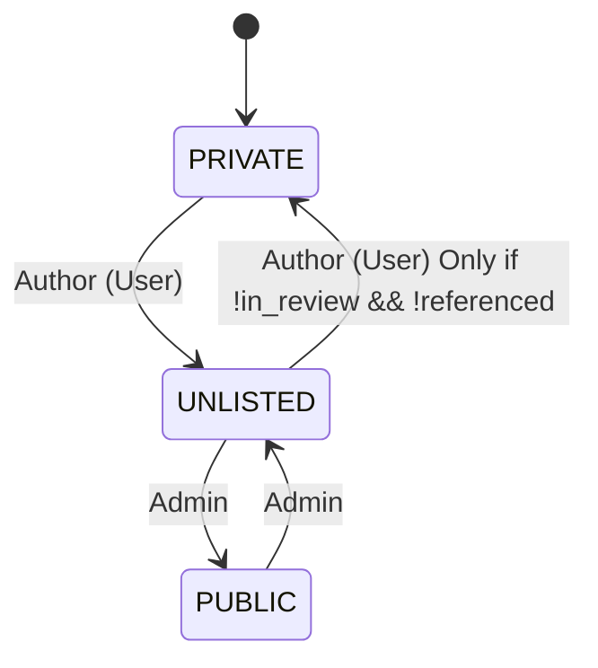

# Cohort Access Control and Lifecycle Management

## Overview

This document provides a comprehensive guide to the access control, visibility, state management, and allowed actions for cohorts within the system. It outlines the requirements, user stories, and design considerations for managing cohort states, ensuring data integrity, enforcing immutability, and supporting collaborative workflows. The goal is to balance user flexibility with compliance, reproducibility, and operational scalability.

## User Stories

### Researcher (User) Stories

As a researcher, I want to:

1. **Create Cohorts**

* Create a new cohort using genotype/phenotype filters.
* Save it as a PRIVATE cohort, visible only to me.

2. **Manage My Cohorts**

* Edit the query of a cohort unless it is locked.
* Edit the name and description unless metadata is locked or the cohort is in review.
* Delete my cohort if no other cohort depends on it.
* Archive a cohort instead of deleting it when it's referenced.

3. **Share Cohorts**

* Share a cohort by making it UNLISTED, so I can collaborate with peers.
* See who has access to my shared cohort.
* Lock the query to prevent future edits once shared, if needed.
* Choose whether others can derive new cohorts from my shared cohort.

4. **Use Shared or Public Cohorts**

* View UNLISTED or PUBLIC cohorts shared with me.
* Clone or derive new cohorts from those marked as derivable.
* Combine multiple cohorts (my own or shared) into a new one using set operations.

5. **Submit Access Requests**

* Lock my cohort and its dependencies when submitting a data access request.
* Provide metadata and justification for review.
* Track the review process and receive feedback or results.
* View the reviewer comments on a rejected request.

6. **Manage Cohort Versions and States**

* View cohort history and states (PRIVATE, UNLISTED, PUBLIC).
* Understand which of my cohorts are used by others (reverse dependency).
* Be notified when a cohort I shared is used in another cohort.

**Functional Requirements – Researcher**

* Must support cohort creation from phenotype/genotype queries or set combinations.
* Must track cohort ownership and enforce visibility rules.
* Allow locking/unlocking of query and metadata.
* Allow sharing cohorts with derivation control.
* Restrict deletion of cohorts with active dependencies.
* Allow cloning of existing cohorts (if derivable).
* Allow access request submission with review tracking.

### Admin Stories

As an admin, I want to:

1. **Curate Cohorts**

* Mark selected UNLISTED cohorts as PUBLIC examples to help new users.
* Demote PUBLIC cohorts to UNLISTED if they're outdated and have no dependencies.
* Archive old cohorts while preserving viewability.

2. **Moderate Dependencies**

* Prevent deletion or privacy downgrades of any cohort that is referenced.
* View full dependency graphs of cohorts.

3. **Support Researchers**

* View audit logs for cohort edits and access request history.
* Support overriding states in case of researcher errors or disputes (e.g., demote PUBLIC to UNLISTED).

**Functional Requirements – Admin**

* Can change visibility between UNLISTED and PUBLIC.
* Cannot view PRIVATE cohorts unless made visible by the user.
* Can view dependency trees across cohorts.
* Can archive or disable derivation for compliance reasons.
* Can override some user locks with warning/audit trail.

### Reviewer Stories

As a reviewer, I want to:

1. **Review Access Requests**

* Access cohorts submitted for data access in a "review" queue.
* View the locked query, name, description, and metadata of the cohort.
* Suggest changes if the cohort lacks clarity or needs improvement.
* Approve or reject the request and log reasoning.

2. **Collaborate with Other Reviewers**

* Leave comments on a request.
* View the review status (pending, under review, resolved).
* See who else is reviewing or has reviewed the request.

3. **Rely on Cohort Stability**

* Be confident that cohort logic does not change during review (locked state).
* Have read-only access to the cohort's query and participant count.

**Functional Requirements – Reviewer**

* Can access only cohorts submitted via access requests.
* Cohorts under review must be locked and UNLISTED.
* Can leave comments, suggest edits, and approve/reject requests.
* Cannot modify cohort content directly.

### Cross-Cutting Requirements

* A cohort’s visibility, lock state, and derivability must be tracked as metadata.
* System must compute and persist cohort dependencies and reverse dependencies.
* System must prevent illegal transitions (e.g., making a shared cohort private when it is used elsewhere).
* Only one user may edit a cohort at a time (basic concurrency control).
* Query must be immutable after locking.
* Cohorts may be marked as archived and hidden from dashboards but remain accessible via reference or ID.


## Data Model

```prisma
model Cohort {
  id          String   @id @default(dbgenerated("gen_random_uuid()")) @db.Uuid
  name        String
  description String?
  query       Json
  metadata    Json?
  created_at  DateTime @default(now()) @db.Timestamp(6)
  updated_at  DateTime @default(now()) @updatedAt @db.Timestamp(6)
  is_temp     Boolean  @default(false)

  participants Int[] // Participant IDs

  visibility      Visibility @default(PRIVATE)
  is_locked       Boolean    @default(false) 
  is_archived     Boolean    @default(false) // 
  is_derivable    Boolean    @default(true) // Indicates if the cohort can be used to create other cohorts

  author_username String
  author          user   @relation(fields: [author_username], references: [username])

  access_requests cohort_access_request[]
}

enum Visibility {
  PRIVATE
  UNLISTED
  PUBLIC
}
```

## Visibility State Transitions



## Actions: Permissions and States

This is an exhaustive list of actions that can be performed on a cohort. Feasibility of an action is contingent on actor role and cohort state.

#### User role permission matrix
| Action    | Private         | Unlisted (owner) | Unlisted (others) | Public          |
| :-------- | :-------------- | :--------------- | :---------------- | :-------------- |
| Create    | ✅              | ✅               | ❌                | ❌              |
| View      | ✅              | ✅               | ✅                | ✅              |
| Search    | ✅              | ✅               | ❌                | ✅              |
| Update    | if not archived | ❌               | ❌                | ❌              |
| Delete    | if unreferenced | ❌               | ❌                | ❌              |
| Clone     | ✅              | ✅               | ✅                | ✅              |
| Derive    | if not archived | if not archived  | if not archived   | if not archived |
| Archive   | ✅              | ✅               | ❌                | ❌              |
| Unarchive | ✅              | ✅               | ❌                | ❌              |
| Request   | ❌              | ✅               | ✅                | ✅              |
| Publish   | ❌              | ❌               | ❌                | ❌              |
| Unpublish | ❌              | ❌               | ❌                | ❌              |


#### Admin role permission matrix (only differences from user role)
| Action                    | Private | Unlisted (owner)                             | Unlisted (others)                            | Public                                       |
| :------------------------ | :------ | :------------------------------------------- | :------------------------------------------- | :------------------------------------------- |
| Search                    |         |                                              | ✅                                           |                                              |
| Update name & description |         | ✅                                           | ✅                                           | ✅                                           |
| Delete                    |         | if unreferenced <br/> or not in review <br/> | if unreferenced <br/> or not in review <br/> | if unreferenced <br/> or not in review <br/> |
| Archive                   |         |                                              |                                              | ✅                                           |
| Unarchive                 |         |                                              |                                              | ✅                                           |
| Publish                   |         | ✅                                           | ✅                                           | -                                            |
| Unpublish                 | -       | -                                            | -                                            | ✅                                           |


## Update Cohort

Only the author of a cohort can update it.


## Publish Cohort

* Unlisted cohorts can be made public by an admin.
* Admins can create a cohort, make it unlisted, and then publish it.
* If admins want to make a cohort created by a researcher public, they must clone it first.
* Admins can unpublish a cohort, but it will not be deleted. It will be marked as unlisted.


## Search
### Researchers
* Researchers can search for cohorts they own, have access to, or public.
* They can search by cohort name, description, and metadata.
* They can filter by visibility (private, unlisted, public) and archived status.

### Admins


## Request Data Access

* Researchers can submit data access requests for their own cohorts, unlisted cohorts they have access to, or public cohorts.
* Before submission, the cohort must be in the unlisted state.
* If a requester tries to submit a request for a private cohort, it should show a warning message and an option to change the cohort's visibility to unlisted. The user should be aware that this action will lock all aspects of the cohort, including the query and metadata.


## Delete Cohort

* Cohorts can be deleted only if they are not referenced by any other cohort or if they are not in review.
* Users should be able to delete their own cohorts if they are in the private state. System should check for references before allowing deletion. System should allow option to cascade delete all references to the cohort.
* Admins can delete any unlisted or public cohort, but they should be cautious about dependencies and references.


## Archive Cohort

Archiving cohorts is necessary to address several key challenges in maintaining a usable, scalable, and compliant research portal. Here's a breakdown of why this feature is important:

1. Cohorts Cannot Always Be Deleted

* Once a cohort is used in the creation of another cohort (via set operations), it becomes a dependency.
* Deleting such a cohort would break reproducibility and traceability of downstream cohorts.
* Archiving offers a safe alternative: the cohort remains accessible (for reproducibility, audits, or reference) but is logically removed from active use.

2. Reduces User Clutter

* Researchers may create dozens or hundreds of temporary or experimental cohorts.
* Over time, many become obsolete but undeletable due to dependencies.
* Archiving allows users to "clean up" their workspace and dashboards without compromising data integrity.

3. Preserves Immutable History

* Archived cohorts serve as a record of past analyses, access requests, or shared resources.
* It’s especially useful in regulated environments (clinical/genomic research) where auditability is important.

4. Supports Controlled Lifecycle Management

* Cohorts go through a lifecycle: draft → shared → used → obsolete.
* Archiving introduces a “final resting state” without needing destructive deletion.
* This helps in compliance with FAIR data principles (Findable, Accessible, Interoperable, Reusable).

5. Avoids Conflicts with Active Features

* Public and shared cohorts may reference older cohorts.
* Users should not be able to alter or delete cohorts once they become “anchored” in the ecosystem.
* Archiving sidesteps the permission and version control complexities of editing shared assets.

6. Enables Efficient Resource Management (Future)

* Archived cohorts could be deprioritized in indexing, caching, or computation.
* They may be offloaded from memory or flagged for long-term storage in resource-intensive systems.


#### **Entering Archived (`is_archived = true`)**

When a cohort **enters archived** state (`is_archived = true`), several automatic state changes might occur:

* **Locked State**: The cohort must be locked (`is_locked = true`) to ensure that the archived version of the cohort cannot be modified.

* **Derivability**: No new cohorts should be derived from an archived cohort. So, the `derivable` flag might automatically be set to **false** to ensure that no further operations can be done on it.


Actions that can be performed on an archived cohort are:
- View the cohort
  - Should be visible in the dashboard but marked as archived (can be filtered using archived=true).
  - Usual visibility rules apply
- Clone the cohort
- Delete the cohort (if not referenced)
- Restore the cohort (un-archive it)


#### **Exiting Archived (`is_archived = false`)**

When a cohort **exits archived** state (`is_archived = false`), the system should allow the cohort to be **re-accessible** or editable again.

All other cohort's properties remain unchanged, but eligible users should be able to change them.


## Lock and Derivable Flags

| Transition / State | is\_locked                            | is\_derivable | Notes                                                                                 |
| :----------------- | :------------------------------------ | :------------ | :------------------------------------------------------------------------------------ |
| PRIVATE → UNLISTED | Set to true                           | Optional      | Author may choose to disable derivability before sharing; not enforced automatically. |
| UNLISTED → PRIVATE | Set to false                          | No change     | Only allowed if cohort is not referenced and not in review.                           |
| UNLISTED → PUBLIC  | Remain true                           | No change     | Enforced automatically. Cohort becomes read-only.                                     |
| PUBLIC → UNLISTED  | Remain true                           | No change     | Public cohorts remain locked even when visibility is reduced.                         |
| Marked as archived | Set to true                           | Set to false  | Archived cohorts are read-only, even for the author.                                  |
| Un-archiving       | Set to false if visibility is PRIVATE | Remain false  | Retains previous locked state                                                         |

* `is_locked` flag is never set explicitly by user. It is set automatically based on the visibility state and cohort lifecycle events.


## Views

**Remove participants array and include participant count**

```sql
SELECT COALESCE(cardinality(c.participants), 0) AS "size"
FROM cohort c
```

**Whether cohort is under review**
```sql
SELECT 
  EXISTS (
    SELECT 1
    FROM cohort_access_request car
    WHERE car.cohort_id = c.id AND car.status IN ('INITIATED', 'PENDING')
  ) AS in_review
FROM cohort c
```

**Whether cohort is referenced by another cohort**
```sql
SELECT 
  EXISTS (
    SELECT 1
    FROM cohort c2
    WHERE c2.query->'schema'->>'name' = 'combination'
      AND c2.query->'body'->'cohort_ids' @> to_jsonb(ARRAY[c.id]::uuid[])
      AND c2.is_temp = false
  ) AS is_referenced
FROM cohort c
```

## Open Questions
- Should we allows researchers to set `is_derivable` on their own cohorts?
- Should we allow admins to set `is_derivable` on public cohorts?
- Granularity of locking: should we allow locking of query, metadata, and flags separately? Metadata consists of cohort name, description, and metadata JSON. Query is the actual SQL query used to generate the cohort.


## Future-Proofing
- Version history for cohorts
- Share unlocked cohorts with other users
- Support for cohort templates
- Support for cohort snapshots
- Collaboration / comment system
- Cohort tagging / labeling
- Integration with publications / citations