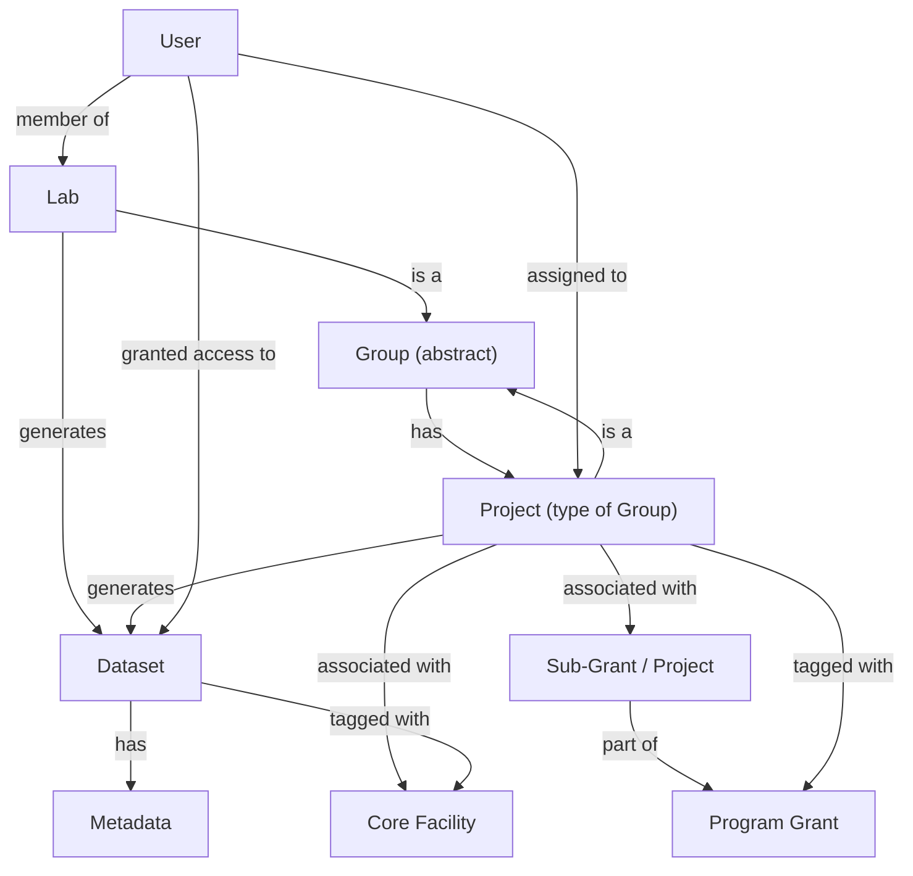
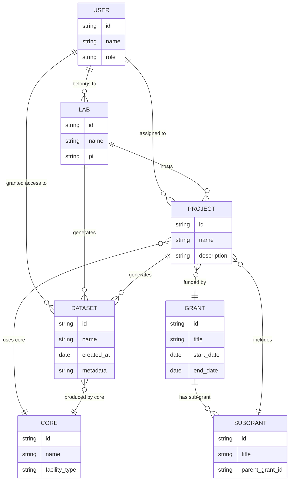

:::info Prompt
can you define different terms used like group, project, labs, grants, etc and their intended meaning so that I don't associate the meanings I know for these words from other contexts and get confused.
This is a for an app that academic and researchers use for managing academic research data.
:::

Absolutely. Here’s how these terms are being used in the context of this academic research data portal:

---

**Lab**
A research group led by a PI (Principal Investigator).

* Represents the primary organizational unit.
* Data products are often generated here. (generated by processing source / raw data from cores)
* Labs may collaborate with other labs or be part of larger centers.

---

**Group**
A general term for any **organizational unit** in the system (Labs, Projects, Centers, etc.).

* The app uses “group” as a structural abstraction.
* Helps manage permissions and relationships uniformly.

---

**Project**
A **type of group** that’s focused on a specific research effort or data collection activity.

* Contains datasets (source, raw, data product)
* Might be linked to a grant, lab, or core facility.
* Treated like a group in the system for consistency, but with extra metadata (e.g. datasets, project goals).

---

**Grant / Program Grant**
Represents a **funding source or umbrella initiative**.

* Can include multiple sub-grants or projects.
* Often associated with multiple labs or cores.
* Useful for tracking where funding is going and which datasets came from which grant.

---

**Core**
A **shared resource or facility** (like a genomics core, imaging core).

* Projects may use services from one or more cores.
* Source and Raw data is generated at cores

---

**Dataset**
A collection of research data generated by a project or lab.

* Has metadata (e.g. method, date, contributors).
* Can be associated with one or more projects, labs, or grants.

---

Let me know if you'd like these in a diagram or if you're unsure about a specific term in usage.

Here’s a Mermaid config that models the relationships between Labs, Projects, Groups, Grants, Cores, and Datasets based on the app's intended structure:

### Key Modeling Notes:

* `Group` is abstract and is used to represent any unit that can own data or users (Labs, Projects).
* `Project` is a subtype of `Group` with its own special attributes.
* Cores are facilities that projects may use, not hierarchical parents.
* Grants fund projects, but don’t directly own data.
* Users belong to labs but can be added to projects individually.

Let me know if you want this rendered visually or extended (e.g. with permissions or discoverability).

Agreed — for this type of data and relationship modeling, an **ER diagram** can make the entities and their attributes/relationships much clearer. Here's a text-based representation of the ER diagram using Mermaid:

### Summary of Relationships:

* **Users** belong to labs, and can be assigned to projects and datasets.
* **Labs** host projects and generate datasets.
* **Projects** are funded by **Grants/Subgrants** and use **Cores**.
* **Datasets** can be linked to both **Projects** and **Cores**.
* **Projects** are a subtype of **Group**, but here treated explicitly as their own entity with a type flag.

Would you like this diagram exported into a visual format (e.g., PNG/SVG), or adapted for a SQL schema?

---
---
---

Absolutely — it's a great idea to establish clear definitions for these terms, especially since academic settings often use the same words (like "project" or "core") in very specific ways. Here's how these terms are used in the context of this research data management portal:

---

## 🧭 Core Concepts and Terms

### 1. Group

* A generic container for organizing users, permissions, and associated datasets.
* Can represent entities like labs, centers, cores, or grants.
* Groups can be hierarchical (e.g., a Center contains Labs).
* Permissions and access control are often managed at the group level.
* From the system's point of view, everything is a "group" with a specific “type” (e.g., lab, grant, core).

### 2. Group Types

Group is the base class — the following are types or instances of it:

#### a. Lab

* Represents a research lab typically led by a PI (Principal Investigator).
* Contains datasets and/or projects generated within the lab.
* Often the most direct unit of data production and ownership.
* May be part of a larger Center or Program.

#### b. Center

* A higher-level organizational unit (e.g., Cancer Center, Genomics Center).
* Composed of multiple labs and/or cores.
* Usually used to manage shared infrastructure or facilitate collaboration across labs.
* Can view all data under its subgroups, depending on permissions.

#### c. Core

* A specialized service or facility (e.g., Bioinformatics Core, Imaging Core).
* Provides services or data processing across many labs or grants.
* Typically doesn’t "own" datasets but is granted access to multiple projects for analysis.

#### d. Grant

* Represents funding awarded for a program or collaborative research effort.
* Can contain subgrants or projects.
* May involve multiple labs, cores, or centers as collaborators.
* Metadata may include grant number, sponsor, duration, etc.

#### e. Subgrant / Subproject

* A smaller project or work package within a larger grant (e.g., R01s under a Program Project Grant).
* Often maps to a specific aim or lab responsibility.
* May own datasets and have its own group structure.

### 3. Project

* A special type of group that directly contains datasets.
* Represents a concrete research activity or experiment.
* May belong to one or more Labs, Grants, or Cores (tagging-based association).
* Has rich metadata (title, abstract, investigators, sample types, etc.).

Projects are the closest thing to “units of work” or “units of data collection” in the system.

### 4. Dataset

* The actual data generated from experiments, often uploaded or linked to a project.
* May include metadata such as modality (e.g., RNA-seq), sample IDs, processing pipeline, etc.
* Resides inside a project and is governed by project- and group-level permissions.

---

## 🔐 Access Control Terms

* Permissions: Rules that determine which users can view, edit, or manage a group, project, or dataset.
* Cascade: Whether permissions from a parent group (e.g., a Center) should apply to subgroups or projects.
* Discoverability: Whether a group/project is visible to users not in the group (like a public profile or directory listing).

---

## 🧑‍🤝‍🧑 User Roles

* User: A general researcher or analyst with access to one or more groups.
* PI (Principal Investigator): Typically owns a lab or grant; can manage users and data under those groups.
* Group Owner: Can approve membership requests and manage permissions.
* Admin: Has elevated permissions to configure the structure and policy of the platform.

---

Let me know if you'd like this turned into a diagram, cheat sheet, or visual map. Or if you want examples (e.g., how a Program Project Grant would be modeled), I can walk you through one.

---
---
---

Based on the notes (both original and your additions), the primary goals of the academic research data management system can be summarized as follows:

---

## 🎯 Primary Goals of the System

### 1. Centralized, Hierarchical Organization of Research Entities

* Represent and navigate complex academic structures like Labs, Centers, Grants, and Cores.
* Support nested and flexible group relationships (e.g., Center > Lab > Project).
* Allow different group types to co-exist and interact via hierarchies or tagging.

### 2. Granular and Flexible Access Control

* Manage permissions at multiple levels (Center, Lab, Project, Dataset).
* Enable permission propagation (e.g., a PI at a Center level can view all data in sub-Labs).
* Allow opt-in cascading or selective control (e.g., don’t always inherit permissions).
* Support shared access scenarios, especially for cross-cutting roles like Cores.

### 3. Discoverability and Transparency

* Let users discover groups they might want to collaborate with.
* Provide fine-grained controls over what information is visible (e.g., group name, number of datasets, collaborators).
* Offer a “Discover Groups” page with filtering, sorting, and metadata previews.

### 4. Metadata-Driven Data Understanding

* Display rich metadata for each dataset and project (modality, contributors, protocols).
* Allow drilling down from a Lab or Grant to view all linked datasets or projects with summaries.

### 5. Support for Collaborative and Multi-Grant Projects

* Enable Projects to be linked to multiple Groups (Labs, Grants, Cores).
* Avoid rigid hierarchies where data can only belong to one parent (instead, use tagging/affiliations).

### 6. Usability for a Range of Roles

* PIs: View and manage data across their groups.
* Users: Easily access data they’re authorized for.
* Admins: Define group structures, approve users, and monitor security.
* Core analysts: Aggregate or access data across multiple groups for analysis.

### 7. Scalable and Intuitive Interface

* Provide both a tree view and card/summary view of groups and data.
* Toggle between simplified and detailed views to reduce clutter.
* Design layout to remain usable as group structures grow in complexity.

---

Would you like a distilled mission statement or guiding design principles next? Or I can mock up some example user flows based on these goals.

